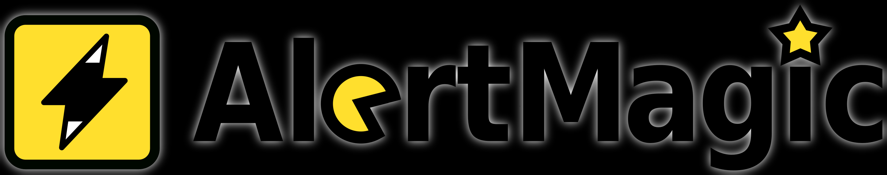

# AlertMagic



AlertMagic avoids ticket duplicates, performs smart field mappings and can perform complex logic on incoming Meraki webhooks.
Effectively and efficiently create/update incidents and problems in AutoTask, Jira, Microsoft Dynamics 365, ServiceNow, ZenDesk and more.

More information at the [AlertMagic Website](https://www.panoramicdata.com/products/alertmagic/)

<hr>

## Template

- [header.liquid](header.liquid)
- [body.liquid](body.liquid)
- HTTP Server URLs:
    * `pdl-alertmagic.azurewebsites.net/api/notify` (production system)
    * `pdl-alertmagic-staging.azurewebsites.net/api/notify` (test/staging system)
- Shared secret:
    * Should be in the form `Base64EncodedUsernameAndPassword`

<hr>

## Creating your shared secret

Let's say your AlertMagic username and password are MYUSERNAME and MYPASSWORD

1. Construct the string `MYUSERNAME:MYPASSWORD`, with a colon separating the two
1. Find a trusted Base 64 encoding system (for example: https://www.base64encode.org/)
1. Get the Base 64 encoded version (in this case `TVlVU0VSTkFNRTpNWVBBU1NXT1JE`)
1. Use this as your shared secret
<hr>

## Applying via Postman

To create your custom Network Webhooks Payload Template, use Postman:

* POST `https://api.meraki.com/api/v1/networks/{{meraki_networkOrConfigTemplate_id}}/webhooks/payloadTemplates`
* Authorization
    * Type: API Key
    * Key: X-Cisco-Meraki-API-Key
    * Value: {{meraki_api_key}}
    * Add to: Header
* Header
    * Content-Type: application/json
* Body
```
{
    "name": "AlertMagic",
    "headers": [
        {
            "name": "Content-Type",
            "template": "application/json"
        },
        {
            "name": "User-Agent",
            "template": "Meraki Webhook"
        },
        {
            "name": "Authorization",
            "template": "Bearer {{sharedSecret}}"
        }
    ],
    "body": {{body}}
}
```
* Pre-request script
```
pm.collectionVariables.set("sharedSecret", "{{sharedSecret}}");

pm.collectionVariables.set("body", JSON.stringify(`{
  "sourceSystem": "meraki",
  "alertData": {{ alertData | jsonify }},
  "alertId": "{{alertId}}",
  "alertLevel": "{{alertLevel}}",
  "alertType": "{{alertType}}",
  "alertTypeId": "{{alertTypeId}}",
  "deviceMac": "{{deviceMac}}",
  "deviceModel": "{{deviceModel}}",
  "deviceName": "{{deviceName}}",
  "deviceSerial": "{{deviceSerial}}",
  "deviceTags": {{deviceTags | jsonify }},
  "deviceUrl": "{{deviceUrl}}",
  "networkId": "{{networkId}}",
  "networkName": "{{networkName}}",
  "networkTags": {{networkTags | jsonify }},
  "networkUrl": "{{networkUrl}}",
  "occurredAt": "{{occurredAt}}",
  "organizationId": "{{organizationId}}",
  "organizationName": "{{organizationName}}",
  "organizationUrl": "{{organizationUrl}}",
  "sentAt": "{{sentAt}}"
}`));
```
