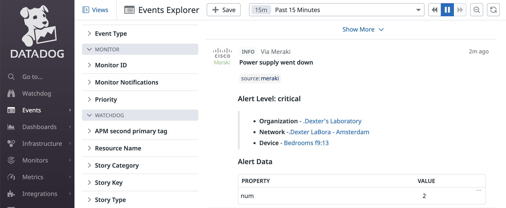

## DataDog 

Log an event with DataDog.

[API Docs](https://docs.datadoghq.com/api/latest/events/)

### Meraki HTTPS Server

**HTTPS URL**
- USA
    - https://api.datadoghq.com/api/v1/events
- Europe
    - https://api.datadoghq.eu/api/v1/events

**Shared Secret**

Use your DataDog API key as the `sharedSecret` value.

- Obtain an API key for your DataDog application.
    - https://docs.datadoghq.com/api/latest/authentication/
    - Manage your DataDog API and application keys [US](https://app.datadoghq.com/organization-settings/api-keys) or [EU](https://app.datadoghq.eu/organization-settings/api-keys)

### Templates

- [headers.liquid](headers.liquid)
- [body.liquid](body.liquid)

