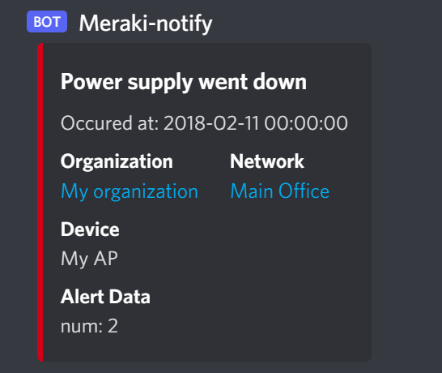
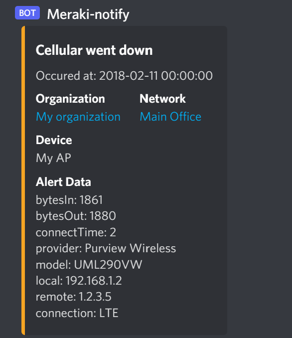
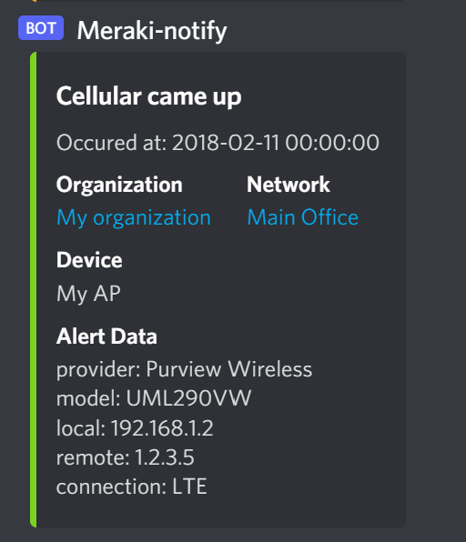

# Alert template for Discord Webhooks

[API Docs](https://discord.com/developers/docs/intro)

Send an alert message to a discord channel

<hr>

## Screenshots




<hr>

## Template 

- [body.liquid](body.liquid)
- HTTP Server URL:  `https://discord.com/api/webhooks/<channel id>/<token>`

```body.liquid
{
  "type": 1,
  "embeds": [{
      "title": "{{alertType}}",
      "color": "13632027160988518311585",
      "description": "Occured at: {{occurredAt | slice: 0,10}} {{occurredAt | slice: 11,8}}",
      "fields": [
        {
        "name": "Organization",
        "value": "[{{organizationName}}]({{organizationUrl}})",
        "inline": true
      },
      {
        "name": "Network",
        "value": "[{{networkName}}]({{networkUrl}})",
        "inline": true
      },
      {
        "name": "Device",
        "value": "{{deviceName}}"
      },
      {
        "name": "Alert Data",
        "value": "{{alertData | json_markdown}}"

      }
      ]
  }]
}
```