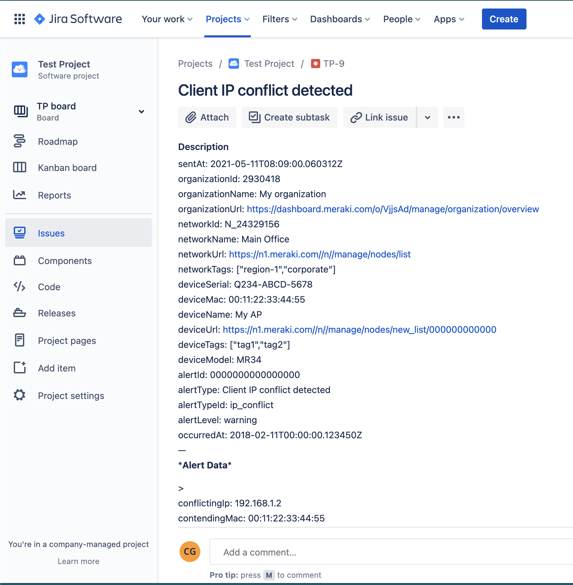

## Jira

[API Docs](https://developer.atlassian.com/server/jira/platform/jira-rest-api-examples/#jira-rest-api-examples)


Generate an issue into an existing Jira Project. 



<hr>

You will first need to [generate an Atlassian API token](https://support.atlassian.com/atlassian-account/docs/manage-api-tokens-for-your-atlassian-account/) for use with Basic Authentication, and then **base64** encode your username and token. 
`username@domain.com:YoUrToKen`

```bash
$ echo "username@domain.com:YoUrToKen" | base64
dXNlcm5hbWVAZG9tYWluLmNvbTpZb1VyVG9LZW4K
```

Then set your httpServer's `sharedSecret` property to

 `Bearer dXNlcm5hbWVAZG9tYWluLmNvbTpZb1VyVG9LZW4K`


### Template 

- [headers.liquid](headers.liquid)
- [body.liquid](body.liquid)
- HTTP Server URL: `https://your-domain.atlassian.net/rest/api/2/issue/createmeta`


```headers.liquid
{
  "Authorization": "{{sharedSecret}}"
}
```
```body.liquid

sentAt: {{sentAt}}
organizationId: {{organizationId}}
organizationName: {{organizationName}}
organizationUrl: {{organizationUrl}}
networkId: {{networkId}}
networkName: {{networkName}}
networkUrl: {{networkUrl}}
networkTags: {{ networkTags | jsonify}}[]
deviceSerial: {{deviceSerial}}
deviceMac: {{deviceMac}}
deviceName: {{deviceName}}
deviceUrl: {{deviceUrl}}
deviceTags: {{ deviceTags | jsonify }}
deviceModel: {{deviceModel}}
alertId: {{alertId}}
alertType: {{alertType}}
alertTypeId: {{alertTypeId}}
alertLevel: {{alertLevel}}
occurredAt: {{occurredAt}}
---
**Alert Data**

> {{alertData | json_markdown}}



{
    "fields": {
       "project":
       {
          "key": "TP"
       },
       "summary": "{{alertType}}",
       "description": {{alertString}},
       "issuetype": {
          "name": "Bug"
       }
   }
}
```