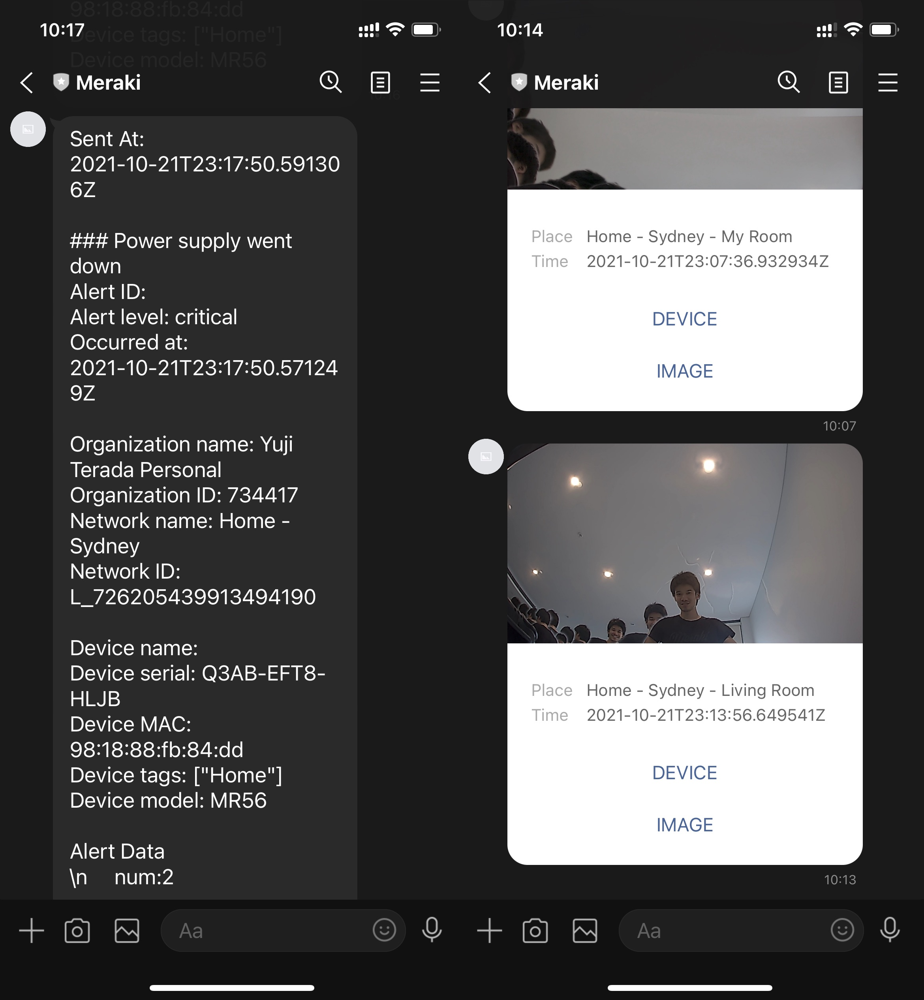
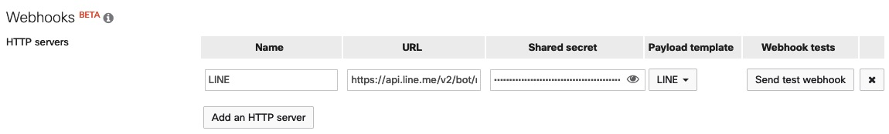
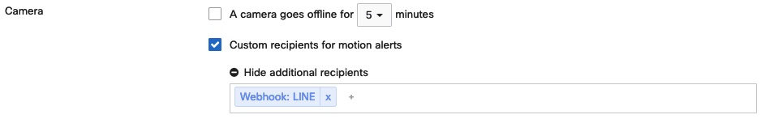

<!-- TABLE OF CONTENTS -->
<details>
  <summary>Table of Contents</summary>
  <ol>
    <li><a href="#about-the-template">About The Template</a></li>
    <li>
      <a href="#getting-started">Getting Started</a>
      <ul>
        <li><a href="#prerequisites">Prerequisites</a></li>
        <li><a href="#create-line-bot">Create LINE Bot</a></li>
        <li><a href="#test-credentials">Test Credentials</a></li>
        <li><a href="#create-custom-template">Create Custom Template</a></li>
        <li><a href="#configure-meraki-dashboard">Configure Meraki Dashboard</a></li>
      </ul>
    </li>
    <li><a href="#resources">Resources</a></li>
  </ol>
</details>

## About The Template

Directly send alerts from the Meraki Dashboard to LINE. Motions alerts will be sent as Flex messages for a prettier look.

<p align="center">
    
</p>

## Getting Started

To send messages on LINE using its APIs, you will first need to create a developer account and create a bot. The end goal is to obtain 
*Your user ID* and *Channel access token* which is required to call the API. This also requires you to be enrolled in Meraki's [Developer Early Access Program](https://developer.cisco.com/meraki/meraki-developer-early-access-program/).

### Prerequisites

- Enrolled in [Developer Early Access Program](https://developer.cisco.com/meraki/meraki-developer-early-access-program/)

### Create LINE Bot

Follow the steps below to create a LINE Business ID and bot. The bot is required to send messages via LINE's Messaging API.

1. Log in to LINE Business ID from [here](https://account.line.biz/login)
2. Create a new provider
3. Create a channel<br/><br/>
   Select *Messaging API* for the *Channel Type*<br/><br/>
4. Confirm channel<br/><br/>
   Click on the newly created channel and you will see tabs such as **Basic settings**, **Messaging API**, and **LIFF**. Click on **Basic settings** and take a note of *Your user ID* located at the bottom. Then click on **Messaging API** and take a note of *Channel access token* also located at the bottom.<br/><br/>

### Test Credentials

Make sure the obtained *Your user ID* and *Channel access token* function properly. In `test.py` placed inside folder `test`, rewrite XXX with *Your user ID* for the constant USER_ID and YYY with *Channel access token* for CHANNEL_ACCESS_TOKEN. 

```python
USER_ID = 'XXX'
CHANNEL_ACCESS_TOKEN = 'YYY'
```

Execute the script, and you should receive a message from the bot if successful.

```console
pip3 install -r requirements
python3 test.py
```

### Create Custom Template

You'll need to rewrite XXX which is line 24 of `body.liquid` with *Your user ID* before creating this custom template in the Meraki Dashboard.

```bash
    "to": "XXX",
```

After rewriting XXX, execute *CRUD_Webhook.py*.

```console
cd line
../CRUD_Webhook.py
```

### Configure Meraki Dashboard

Open **Network-wide > Alerts** and scroll down to Webhooks. Add an HTTP server with the following details.

- Name: LINE
- URL: https://api.line.me/v2/bot/message/push
- Shared secret: *Channel access token*
- Payload template: LINE

<p align="center">
    
</p>

Once you save, hit the **Send test webhook** button, and test if it works.

Lastly, don't forget to add LINE as the receipient of alerts.

<p align="center">
    
</p>


## Resources
- [Messaging API overview](https://developers.line.biz/en/docs/messaging-api/overview/)
- [Getting started with the Messaging API](https://developers.line.biz/en/docs/messaging-api/getting-started/)
- [Messaging API reference](https://developers.line.biz/en/reference/messaging-api/)
- [Flex Message Simulator](https://developers.line.biz/flex-simulator/)
