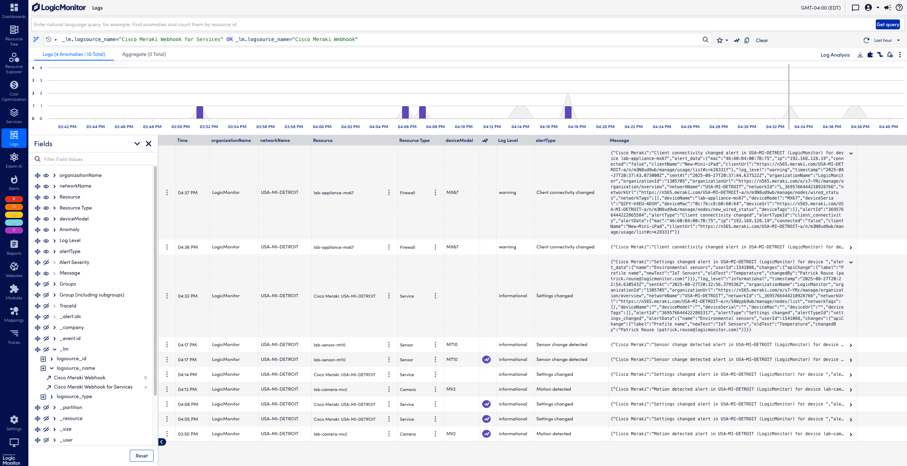
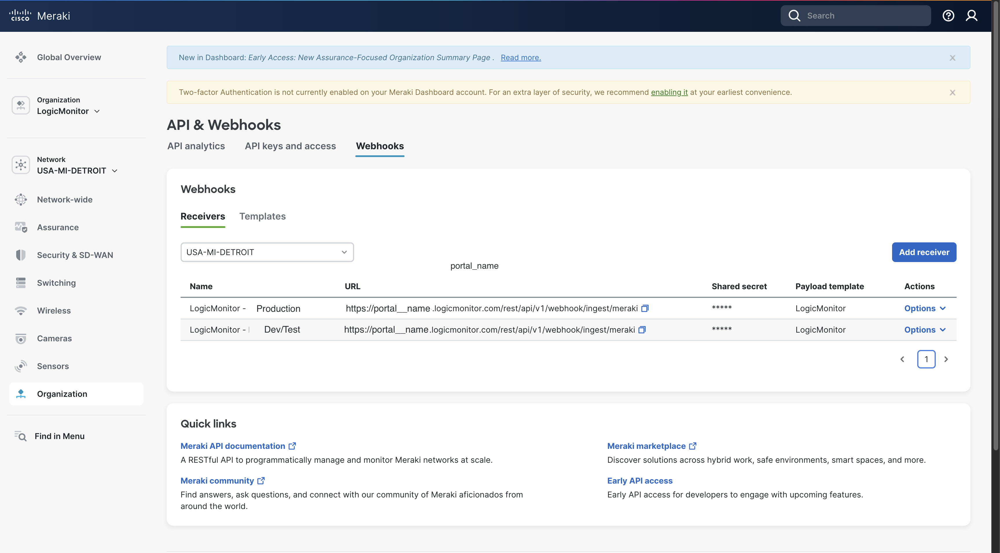

# Cisco Meraki Webhook Payload Template for LogicMonitor


<picture>
  <source media="(prefers-color-scheme: dark)" srcset="LogicMonitor_logo_and_tagline_RBG_White.png">
  <source media="(prefers-color-scheme: light)" srcset="LogicMonitor_logo_and_tagline_RBG_Navy.png">
  
</picture>


## Preview

 

## Files
- `body.liquid` – Defines the JSON body of the webhook payload.
- `headers.liquid` – Defines any custom headers required by the LogicMonitor ingest endpoint.
- `Cisco Meraki Webhooks.json` - example Webhook LogSource (also available via LogicMonitor Module Exchange)
- `Cisco Meraki Webhooks for Services.json` - example Webhook LogSource (also available via LogicMonitor Module Exchange)

## Usage
1. Install the Cisco Meraki Webhook LogSources
    - Go to **LogicMonitor → Settings → LogicModules → Exchange -> LogSources -> Cisco Meraki Webhooks**. This maps device-based alerts to the relevant devices based on matching Cisco Meraki serial number.
    - Go to **LogicMonitor → Settings → LogicModules → Exchange -> LogSources -> Cisco Meraki Webhooks for Services** This maps Cisco Meraki Dashboard configuration changes to LogicMonitor Services with the Network ID set as a host property of meraki.api.network.
2. Generate a Bearer Token from your LogicMonitor Portal -> https://www.logicmonitor.com/support/adding-a-bearer-token
3. Add a new Webhook Template to your Cisco Meraki Dashboard:
   - Go to **Organization → Configure → APIs & Webhooks → Webhooks -> Templates**.
   - Click **Create Template** and paste the contents of `body.liquid` and `headers.liquid`.
  
4. Add a new Receiver via
   - Go to **Organization → Settings → Webhooks → Receivers -> Add Receiver**.
   - Give your Receiver a name, like "My LogicMonitor Portal Name + Optional Tenant Name"
   - Enter your portal webhook reveiver URL, like https://myportalname.logicmonitor.com/rest/api/v1/webhook/ingest/meraki
   - Paste your LogicMonitor Bearer Token into the "Shared Secret Field"
   - Select your LogicMonitor Payload Template and Save.
  

  
5. Add this Receiver to the desired Meraki Networks via
 - Go to **Organization → Network Name → Network Wide → Alerts**.

## Example Header
```json
{
  "Authorization": "Bearer {{sharedSecret}}"
}
```

## Example Body
```json
{
  "Cisco Meraki": "{{ alertType }} alert in {{ networkName }} ({{ organizationName }}) for device {{ deviceName }}",
  "alert_data": {{ alertData | jsonify }},
  "log_level": "{{ alertLevel }}",
  "timestamp": "{{ occurredAt }}",
  "sentAt": "{{ sentAt }}",
  "organizationName": "{{ organizationName }}",
  "organizationId": "{{ organizationId }}",
  "organizationUrl": "{{ organizationUrl }}",
  "networkName": "{{ networkName }}",
  "networkId": "{{ networkId }}",
  "networkUrl": "{{ networkUrl }}",
  "networkTags": {{ networkTags | jsonify }},
  "deviceName": "{{ deviceName }}",
  "deviceModel": "{{ deviceModel }}",
  "deviceSerial": "{{ deviceSerial }}",
  "deviceMac": "{{ deviceMac }}",
  "deviceUrl": "{{ deviceUrl }}",
  "deviceTags": {{ deviceTags | jsonify }},
  "alertId": "{{ alertId }}",
  "alertType": "{{ alertType }}",
  "alertTypeId": "{{ alertTypeId }}",
  "alertData": {{ alertData | jsonify }}
}
```
