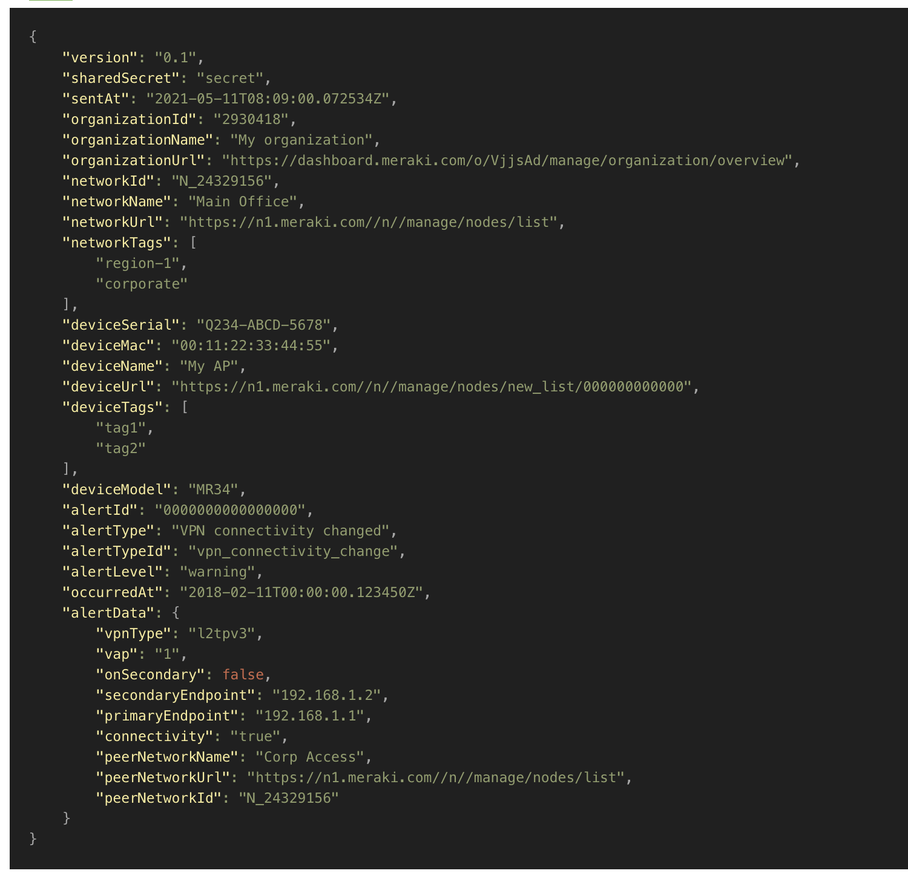

## Meraki

The default style for a Meraki webhook.



<hr>

### Template 

- [body.liquid](body.liquid)

```body.liquid
{
    "version": "0.1",
    "sharedSecret": "{{sharedSecret}}",
    "sentAt": "{{sentAt}}",
    "organizationId": "{{organizationId}}",
    "organizationName": "{{organizationName}}",
    "organizationUrl": "{{organizationUrl}}",
    "networkId": "{{networkId}}",
    "networkName": "{{networkName}}",
    "networkUrl": "{{networkUrl}}",
    "networkTags": {{networkTags | jsonify}},
    "deviceSerial": "{{deviceSerial}}",
    "deviceMac": "{{deviceMac}}",
    "deviceName": "{{deviceName}}",
    "deviceUrl": "{{deviceUrl}}",
    "deviceTags": {{ deviceTags | jsonify }},
    "deviceModel": "{{deviceModel}}",
    "alertId": "{{alertId}}",
    "alertType": "{{alertType}}",
    "alertTypeId": "{{alertTypeId}}",
    "alertLevel": "{{alertLevel}}",
    "occurredAt": "{{occurredAt}}",
    "alertData": {{alertData | jsonify}}
}
```
```json result
{
    "version": "0.1",
    "sharedSecret": "secret",
    "sentAt": "2021-05-11T08:09:00.072534Z",
    "organizationId": "2930418",
    "organizationName": "My organization",
    "organizationUrl": "https://dashboard.meraki.com/o/VjjsAd/manage/organization/overview",
    "networkId": "N_24329156",
    "networkName": "Main Office",
    "networkUrl": "https://n1.meraki.com//n//manage/nodes/list",
    "networkTags": ["region-1","corporate"],
    "deviceSerial": "Q234-ABCD-5678",
    "deviceMac": "00:11:22:33:44:55",
    "deviceName": "My AP",
    "deviceUrl": "https://n1.meraki.com//n//manage/nodes/new_list/000000000000",
    "deviceTags": ["tag1","tag2"],
    "deviceModel": "MR34",
    "alertId": "0000000000000000",
    "alertType": "VPN connectivity changed",
    "alertTypeId": "vpn_connectivity_change",
    "alertLevel": "warning",
    "occurredAt": "2018-02-11T00:00:00.123450Z",
    "alertData": {"vpnType":"l2tpv3","vap":"1","onSecondary":false,"secondaryEndpoint":"192.168.1.2","primaryEndpoint":"192.168.1.1","connectivity":"true","peerNetworkName":"Corp Access","peerNetworkUrl":"https://n1.meraki.com//n//manage/nodes/list","peerNetworkId":"N_24329156"}
}
    
```