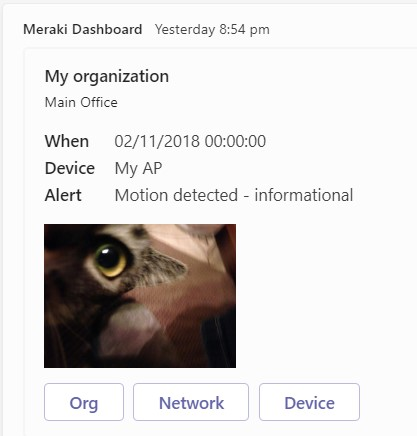
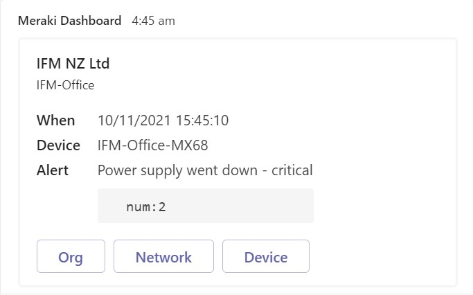

## Microsoft TEams

[API Docs](https://docs.microsoft.com/en-us/microsoftteams/platform/webhooks-and-connectors/how-to/connectors-using?tabs=cURL)

Post a webhook alert into a Microsoft Teams channel.




<hr>

You will first need to [WebHook enable the channel](https://docs.microsoft.com/en-us/microsoftteams/platform/webhooks-and-connectors/how-to/add-incoming-webhook).
This process creates the HTTP server URL to enter into the Meraki Dashboard.

Next run the [load-meraki-template.py](load-meraki-template.py) Python script to load the template into the Cisco Meraki Dashboard.

### Template 

- [headers.liquid](headers.liquid)
- [body.liquid](body.liquid)
- HTTP Server URL: `https://your-domain.atlassian.net/rest/api/2/issue/createmeta`


```headers.liquid
{
}
```
```body.liquid
load-meraki-template.py
```