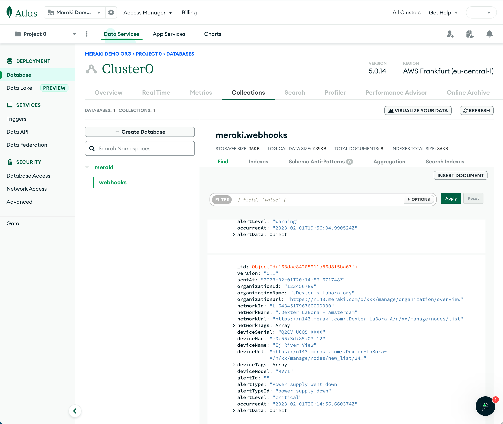

## MongoDB Atlas 

Log Meraki webhooks to a MongoDB database collection

[API Docs](https://www.mongodb.com/docs/atlas/api/data-api/)

### Configuring MongoDB

- Enable the [Data API](https://www.mongodb.com/docs/atlas/api/data-api/) and create a new API key.
- Grant Network Access to the possible Meraki IP ranges.

>
    64.62.142.12/32
    108.161.147.0/24
    158.115.128.0/19
    199.231.78.0/24
    209.206.48.0/20
    216.157.128.0/20

### Meraki HTTPS Server

**HTTPS URL**
- `https://data.mongodb-api.com/app/<YOUR_APP_ID>/endpoint/data/v1/action/insertOne`

**Shared Secret**

Use your MongoDB API key as the `sharedSecret` value.

  

### Templates

- [headers.liquid](headers.liquid)
- [body.liquid](body.liquid)

