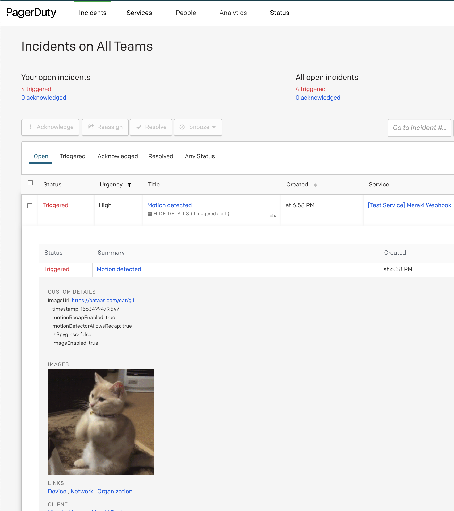

## PagerDuty 


[API Docs](https://developer.pagerduty.com/docs/events-api-v2/trigger-events/)

Create an incident in PagerDuty.



<hr>

### Template 

- [body.liquid](body.liquid)
- HTTP Server URL: `https://events.pagerduty.com/v2/enqueue`

```body.liquid
{
    "payload": {
        "summary": "{{alertType}}",
        "timestamp": "{{occurredAt}}",
        "source": "{{networkId}}",
        "organizationId": "{{organizationId}}",
        "severity": "infowarning",
        "component": "{{deviceName}}",
        "group": "{{networkName}}",
        "class": "deploy",
        "custom_details": {{alertData | json_markdown | jsonify }}
    },
    "routing_key": "{{sharedSecret}}",
    "dedup_key": "{{alertId}}",
    "images": [
        {
            "src": "{{alertData.imageUrl}}",
            "href": "{{alertData.imageUrl}}",
            "alt": "Image"
        }
    ],
    "links": [
        {
            "href": "{{deviceUrl}}",
            "text": "Device"
        },
        {
            "href": "{{networkUrl}}",
            "text": "Network"
        },
        {
            "href": "{{organizationUrl}}",
            "text": "Organization"
        }
    ],
    "event_action": "trigger",
    "client": "Manage Meraki Device",
    "client_url": "{{deviceUrl}}"
}

```