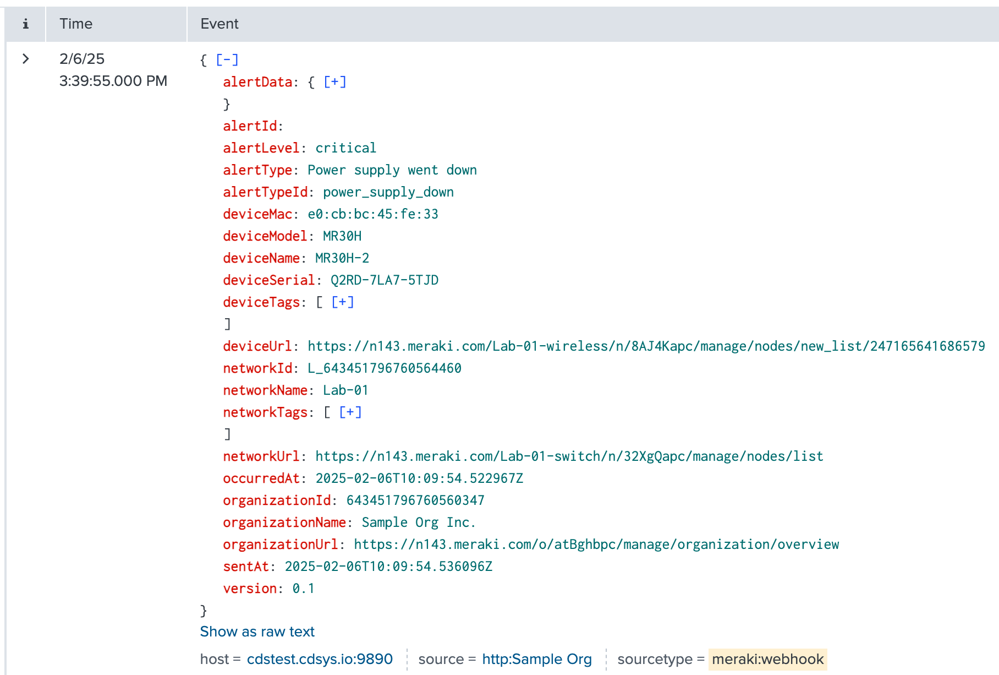

# Splunk addon for Cisco Meraki

The addon enables you to send Meraki webhook alerts to Splunk.

## Configuration Steps

### 1. [Download the addon for Meraki](https://splunkbase.splunk.com/app/5580)

### 2. Get a HEC token from your Splunk instance.
[Splunk API Documentation](https://docs.splunk.com/Documentation/Splunk/9.4.0/Data/UsetheHTTPEventCollector)

### 3. Access Meraki Dashboard
1. Log in to your Meraki dashboard
2. Navigate to Organizations > API & Webhooks in the left panel

### 4. Create Splunk Webhook Template
1. Go to the Webhooks tab
2. Select Templates
3. Click "New Template"
4. Fill in the template details:
   - Enter a unique Template Name
   - Configure the Liquid Body (see [body.liquid](body.liquid))
   - Click "Generate Preview" to validate the schema

### 5. Configure Template Headers
1. In the Liquid Header section:
2. Click "Add" and enter:
   - Key: `Authorization`
   - Value: `Splunk {{sharedSecret}}`
3. Save the template

### 6. Create Webhook Receiver
1. Navigate to the Receivers tab
2. Configure the new receiver:
   - Name: Enter a descriptive name
   - URL: Enter your Splunk receiver URL
   - Shared Secret: Your Splunk HEC token
   - Payload Template: Select the template created above

## Important Notes

### URL (httpServer)
Splunk URL format : 

`https://{{ip/instance name}}:{{HEC Port configured on splunk}}/services/collector/event`

(Eg : https://abcanc.io:1234/services/collector/event)

The URL should be using HTTPS and have a verified SSL certificate to receive data from Cisco Meraki.

Save the configuration and you have successfully configured the webhook receiver for Splunk.

### Template 

- [body.liquid](body.liquid)
- [headers.liquid](headers.liquid)
- HTTP Server URL: 
    - https://mysplunkserver.example.com:8088/services/collector/event
    -  Set the "sharedSecret" to your Splunk Token (i.e. `12345678-1234-1234-1234-1234567890AB`)
    