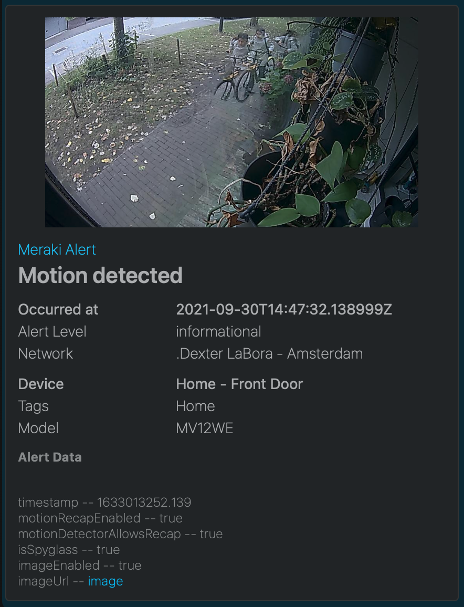

## Webex - Adaptive Cards

Build amazing looking messages using Adaptive Cards with the Webex API. Include pictures, rich text and actions with every Meraki alert. 


<hr>

Webex offers a helpful card designer tool, which can generate the JSON scaffolding for our template. Then, replace the values you want to be included using the `{{variable}}` syntax and save this as your `body.liquid` file. 


> NOTE: The Webex REST API requires authentication for this to work. 

Webex API Resources
- [API Keys & Authentication](https://developer.webex.com/docs/api/getting-started)
- [Messages API](https://developer.webex.com/docs/api/v1/messages/create-a-message)
- [Webex Card Designer](https://developer.webex.com/buttons-and-cards-designer) 


### Templates
- [body.liquid](body.liquid)
- [headers.liquid](headers.liquid)
- HTTP Server URL: `https://webexapis.com/v1/messages`

```body.liquid

**Alert Data**




{{p}} --  [image]({{alertData[p]}})
 
{{p}} --  {{alertData[p]| jsonify}}



{
    "roomId": "YOUR_ROOM_ID",
    "markdown": "{{alertType}} - {{networkUrl}}",
    
    "files": [
        "{{alertData.imageUrl}}"
    ],
    
    "attachments": [
        {
            "contentType": "application/vnd.microsoft.card.adaptive",
            "content": {
                "type": "AdaptiveCard",
                "body": [
                    {
                        "type": "ColumnSet",
                        "columns": [
                        {
                                "type": "Column",
                                "items": [
                                  
                                    {
                                      "type": "Image",
                                      "url": "{{alertData.imageUrl}}",
                                      "size": "Large",
                                      "height": "200px"
                                    },
                                
                            
                                    {
                                        "type": "TextBlock",
                                        "text": "Meraki Alert",
                                        "weight": "Lighter",
                                        "color": "Accent"
                                    },
                                    {
                                        "type": "TextBlock",
                                        "weight": "Bolder",
                                        "text": "{{alertType}}",
                                        "wrap": true,
                                        "color": "Light",
                                        "size": "Large",
                                        "spacing": "Small"
                                    }
                                ],
                                "width": "stretch"
                            }
                        ]
                    },
                    {
                        "type": "ColumnSet",
                        "columns": [
                            {
                                "type": "Column",
                                "width": 35,
                                "items": [
                                    {
                                        "type": "TextBlock",
                                        "text": "Occurred at",
                                        "color": "Light"
                                    },
                                    {
                                        "type": "TextBlock",
                                        "text": "Alert Level",
                                        "weight": "Lighter",
                                        "color": "Light",
                                        "spacing": "Small"
                                    },
                                    {
                                        "type": "TextBlock",
                                        "text": "Network",
                                        "weight": "Lighter",
                                        "color": "Light",
                                        "spacing": "Small"
                                    }
                                ]
                            },
                            {
                                "type": "Column",
                                "width": 65,
                                "items": [
                                    {
                                        "type": "TextBlock",
                                        "text": "{{occurredAt}}",
                                        "color": "Light"
                                    },
                                    {
                                        "type": "TextBlock",
                                        "text": "{{alertLevel}}",
                                        "color": "Light",
                                        "weight": "Lighter",
                                        "spacing": "Small"
                                    },
                                    {
                                        "type": "TextBlock",
                                        "text": "{{networkName}}",
                                        "weight": "Lighter",
                                        "color": "Light",
                                        "spacing": "Small"
                                    }
                                ]
                            }
                        ],
                        "spacing": "Padding",
                        "horizontalAlignment": "Center"
                    },
                    {
                        "type": "ColumnSet",
                        "columns": [
                            {
                                "type": "Column",
                                "width": 35,
                                "items": [
                                    {
                                        "type": "TextBlock",
                                        "text": "Device",
                                        "color": "Light"
                                    },
                                    {
                                        "type": "TextBlock",
                                        "text": "Tags",
                                        "weight": "Lighter",
                                        "color": "Light",
                                        "spacing": "Small"
                                    },
                                    {
                                        "type": "TextBlock",
                                        "text": "Model",
                                        "weight": "Lighter",
                                        "color": "Light",
                                        "spacing": "Small"
                                    }
                                ]
                            },
                            {
                                "type": "Column",
                                "width": 65,
                                "items": [
                                    {
                                        "type": "TextBlock",
                                        "text": "{{deviceName}}",
                                        "color": "Light"
                                    },
                                    {
                                        "type": "TextBlock",
                                        "text": "{{deviceTags}}",
                                        "color": "Light",
                                        "weight": "Lighter",
                                        "spacing": "Small"
                                    },
                                    {
                                        "type": "TextBlock",
                                        "text": "{{deviceModel}}",
                                        "weight": "Lighter",
                                        "color": "Light",
                                        "spacing": "Small"
                                    }
                                ]
                            }
                        ],
                        "spacing": "Padding",
                        "horizontalAlignment": "Center"
                    },
                    {
                        "type": "TextBlock",
                        "text": {{markdown | jsonify}},
                        "wrap": true,
                        "fontType": "Default",
                        "size": "Small",
                        "weight": "Lighter",
                        "color": "Light",
                        "isSubtle": true
                    }
                ],
                "$schema": "http://adaptivecards.io/schemas/adaptive-card.json",
                "version": "1.2"
            }
        }
    ]
}
```
```headers.liquid
{
    "Authorization": "Bearer {{sharedSecret}}"
}
```