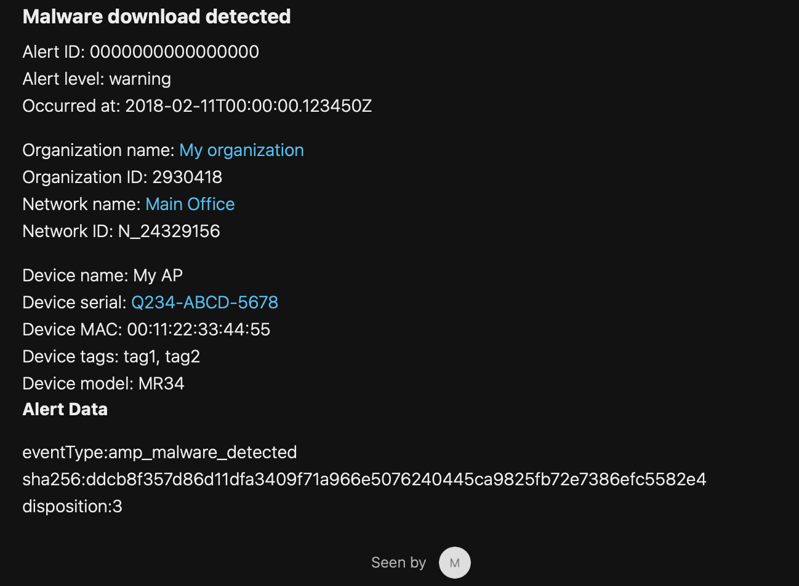

## Webex 


[API Docs - Incoming Webhooks](https://apphub.webex.com/messaging/applications/incoming-webhooks-cisco-systems-38054)

Send a message to a Webex room.


<hr>


### Template 

- [body.liquid](body.liquid)
- HTTP Server URL: `https://webexapis.com/v1/webhooks/incoming/<YOUR DYNAMIC URL>`


```body.liquid
`
### {{alertType}}
Alert ID: {{alertId}}
Alert level: {{alertLevel}}
Occurred at: {{occurredAt}}

Organization name: {{organizationName}}
Organization ID: {{organizationId}}
Network name: {{networkName}}
Network ID: {{networkId}}

Device name: {{deviceName}}
Device serial: {{deviceSerial}}
Device MAC: {{deviceMac}}
Device tags: {{deviceTags | jsonify}}
Device model: {{deviceModel}}

Alert Data
>>
{{alertData | json_markdown}}



{
    "sentAt": "{{sentAt}}",
    "markdown": {{markdown | jsonify}},
    "networkId": "{{networkId}}"
}
```